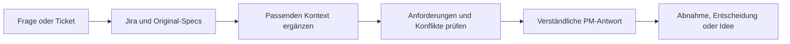

# fvk-powers

**Rewrite verstehen. Tickets schärfen. Abnahmen vorbereiten.**

**Paketchecks: lokal bestanden · PM-Pilot: offen**

[](https://github.com/TimoDeg/fvk-powers/actions/workflows/check.yml)

Ein Assistent für PMs, der Jira mit den passenden Original-Specs verbindet und verständlich antwortet. Kundenwirkung und fachliche Entscheidungen stehen im Vordergrund. Technische Keywords werden nur verwendet, wenn sie helfen, und kurz erklärt.

> **Stand: Vorbereitung für den PM-Pilot.** Quellenzugriffe und synthetische Antworten wurden geprüft. Die separate Modellbewertung akzeptiert 12/12 Erstantworten; eine menschliche PM-Abnahme bleibt offen. Paketchecks, Modelltests und echte PM-Nutzung sind getrennte Nachweise.

## In einem Satz starten

Dieses private Repo lokal klonen, als Projekt in Codex öffnen und im Chat schreiben:

> **Richte fvk-powers für mich ein.**

Der Assistent erklärt den nächsten Schritt, prüft vorhandene Quellen und fragt nur nach fehlenden Angaben. Anmeldung erfolgt im vorgesehenen Dienst; keine Passwörter im Chat. „Setup weiter“ setzt bei der offenen Stelle fort. [So funktioniert der Setup-Dialog](SETUP.md).

Du brauchst einen Assistenten mit Dateizugriff, einen freigegebenen Jira-Lesezugang und Zugriff auf das Rewrite-Repo. Für PM-Fragen ist keine laufende Produktanwendung nötig. [Alle Voraussetzungen und optionalen Werkzeuge](docs/DEPENDENCIES.md).

## Die Pipeline



| Du fragst | Du bekommst |
| --- | --- |
| „Was bedeutet dieses Ticket?“ | Fachliches Ziel, Kundenwirkung und wichtige Bedingungen |
| „Passt das zur Spec?“ | Übereinstimmungen, Widersprüche und fehlende Entscheidungen mit Quellen |
| „Was muss ich abnehmen?“ | Konkrete Ausgangslagen, Schritte und erwartete Ergebnisse |
| „Welche Verbesserung wäre sinnvoll?“ | Begründete Ideen, erkennbar getrennt von verbindlichen Anforderungen |
| „Ist das schon live?“ | Den belegbaren Stand und die noch fehlenden Release-/Laufzeitnachweise |

Die [Kontextlandkarte](CONTEXT.md) führt zu fachlichen Beschreibungen, Architekturentscheidungen, passenden Codebereichen und Testquellen. Specs bleiben im Produktrepo gepflegt. Persönliche Skills, private Wissenskopien und Suchindizes sind keine Voraussetzung. Der vollständige Implementierungs- und Deployment-Ablauf ist nicht portiert; [enthaltene und offene Teile](docs/VALIDATION.md).

## Zahlen mit klarer Bedeutung

Momentaufnahme vom **17.09.2026**. Details und Grenzen stehen im [Prüfbericht](docs/VALIDATION.md).

| Kennzahl | Stand | Was sie belegt |
| --- | ---: | --- |
| Regressionstests des Paketprüfers | **12 / 12 bestanden** | Beschädigte Links, private Dateien, fehlende Einstiege und ungültige Eval-Fälle werden erkannt |
| Automatische Paket-Prüfgruppen | **5 / 5 bestanden** | Wiederholbare Offline-Prüfung, aktuell lokal ausgeführt |
| Isolierter frischer Paket-Clone | **1 bestanden** | Checks ohne persönlichen Kontext oder Produktcheckout lauffähig; kein PM-Chat-Test |
| Kontext-Einstiege im lokalen Produktrepo | **17 / 17 vorhanden** | Die geprüften Pfade existieren; kein Vollständigkeitsversprechen |
| Unterschiedliche echte Tickets mit begrenztem Quellenabgleich | **3** | Am bestehenden Arbeitsplatz geprüft; keine drei PM-Abnahmen |
| Vorbereitete Antwort-Eval-Fälle | **12** | Entwicklungsset für Fakten, Konflikte, Setup, Sicherheit und Sprache |
| Separat modellbewertete Erstantworten | **12 / 12 akzeptiert (Baseline v1)** | Synthetisches Entwicklungsset, keine menschliche Bewertung |
| Kritische Fälle mit drei akzeptierten Versuchen | **4 / 4** | Konflikt, fehlende Spec, veralteter Status, Anweisungen in Quellen; insgesamt 8 zusätzliche Antworten |
| Frische PM-Setups vollständig beobachtet | **0** | Pilotabnahme noch offen |
| Echter Setup-Test mit frischem Agenten | **2 Durchläufe erfolgreich** | Derselbe Einstieg vor/nach gezielter Jira-Feldauswahl; isolierte Clones und bestehende Host-Zugangsdaten |
| Zusätzliche Python-/npm-Pakete | **0** | Paketchecker nutzt Standardbibliothek; externe Client- und Quellenzugänge bleiben nötig |

Die 20 Modellantworten sind protokolliert; jede wurde in einem frischen Agentkontext erzeugt und danach separat bewertet. Zwei kleine Hinweise zur Quellenbezeichnung und Setup-Erklärung bleiben. Nach dieser Baseline wurde der Jira-Abruf auf gezielte Felder eingegrenzt und im echten Setup erneut erfolgreich geprüft; die 20 Antworten sind keine erneute Bewertung dieses geänderten Regelstands. Ein kleines bekanntes Entwicklungsset belegt keine allgemeine Zuverlässigkeit. [Ergebnisse, Grenzen und unveränderte Ausgaben](evals/results/2026-09-17-v1.md) · [Messmethodik](evals/README.md).

## So sollen Antworten aussehen

Die Beispiele sind **erfunden und redaktionell geschrieben**, keine beobachteten Benchmark-Ausgaben. In echten Antworten stehen Links zu den tatsächlich gelesenen Quellen.

### Ein Ticket verstehen

**PM:** „Was sollen die Favoriten können, und was fehlt noch?“

> Kunden sollen bis zu drei Angebote als Favoriten markieren können. Wählen sie ein viertes aus, erscheint laut Beispiel-Spec ein Hinweis; die bisherigen drei bleiben erhalten.
>
> Offen ist, ob die Auswahl nach dem Schließen und erneuten Öffnen der Seite noch vorhanden sein soll. Das sollten wir vor der Abnahme klären. Ob die Funktion schon umgesetzt ist, ist hier nicht geprüft.

### Einen Widerspruch erkennen

**PM:** „Kann ich das Auswahl-Limit so abnehmen?“

> Das Ticket nennt drei Favoriten, die Spec fünf. Damit fehlt für diesen Punkt ein eindeutiges Abnahmekriterium. Klärt zuerst, welches Limit gelten soll. Die widersprüchlichen Angaben allein beweisen noch keinen Fehler in der Anwendung.

<details>
<summary><strong>Abnahme und Verbesserungsidee ansehen</strong></summary>

**PM:** „Was sollte ich testen? Gibt es eine kleine Verbesserung?“

> Wähle zunächst drei Favoriten aus und versuche, ein viertes Angebot hinzuzufügen. Erwartung laut Beispiel-Spec: Ein Hinweis erscheint, die ursprünglichen drei bleiben ausgewählt. Diese Prüfung ist vorgeschlagen, noch nicht ausgeführt.
>
> **Idee:** Ein Zähler wie „2 von 3 ausgewählt“ könnte das Limit früher verständlich machen. Das ist ein zusätzlicher Vorschlag. Prüft vorher, ob Kunden mit dem bisherigen Hinweis bereits zurechtkommen.

</details>

[Weitere Beispiele und Setup-Abnahmefälle](examples/pm.md).

### Beobachtete Antwort aus dem Modelltest

**Testfrage:** „Ist das Feature jetzt live?“ Die synthetischen Quellen enthielten einen eine Woche alten Done-Status und keine Deploymentbelege. Unveränderte Ausgabe:

> Ob das Feature jetzt live ist, ist nicht bestätigt. Das Ticket stand vor einer Woche auf „Done“; die Spec beschreibt nur, dass das Feature vorgesehen ist. Belege für eine Veröffentlichung fehlen.
>
> Als Nächstes müssen wir den aktuellen Ticketstand, einen Deploymentbeleg für die Produktivumgebung und das dort sichtbare Verhalten prüfen.

[Alle Antworten und Bewertungen](evals/results/2026-09-17-v1.json).

## Prüfen und weiterentwickeln

Für Maintainer, ohne zusätzliche Pakete:

```sh
python3 -m unittest discover -s tests -v
python3 tools/check.py
# Optional: nur lesend gegen den eigenen Produktcheckout
python3 tools/check.py --product-repo ../fvk
```

Die nächsten Schritte sind ein **frisches menschliches PM-Setup**, **unbekannte Antwortfälle** und **die fachliche PM-Bewertung dreier echter Tickets**. Setup-Zeit, Rückfragen, fachliche Fehler und Verständlichkeit werden dabei getrennt erfasst. [Prüfplan und Freigabekriterien](evals/README.md).

Der [GitHub-Workflow](.github/workflows/check.yml) führt bei Pushes und Pull Requests die 12 Checker-Tests und die Paketprüfung aus. Er kann auch manuell gestartet werden. Den aktuellen Laufstatus zeigt das Badge oben. Die CI liest keine Jira-Tickets und bewertet keine Modellantworten.

| Datei | Zweck |
| --- | --- |
| [AGENTS.md](AGENTS.md) | Gemeinsamer Ablauf und Quellenregeln |
| [SETUP.md](SETUP.md) | Geführte Einrichtung im Chat |
| [CONTEXT.md](CONTEXT.md) | Die passende Originalquelle finden und Kontext fortführen |
| [PM-Profil](profiles/pm.md) | Verständliche Antworten, klare Unsicherheit, hilfreiche Ideen |
| [Dependencies](docs/DEPENDENCIES.md) | Nötige Zugänge und optionale Werkzeuge |
| [Prüfbericht](docs/VALIDATION.md) | Ausgeführte Checks, Grenzen und offene Arbeit |
| [Eval-Plan](evals/README.md) | Messdefinitionen und Testfälle |

Standardmäßig arbeitet der Assistent lesend. Jira-Änderungen, Nachrichten an andere, Produktänderungen und Veröffentlichungen brauchen den jeweiligen ausdrücklichen Auftrag. Lokale Quellenangaben und private Belege bleiben unter dem ausgeschlossenen `.local/`; dieses Repo verteilt keine Ticketkopien oder Zugangsdaten.
